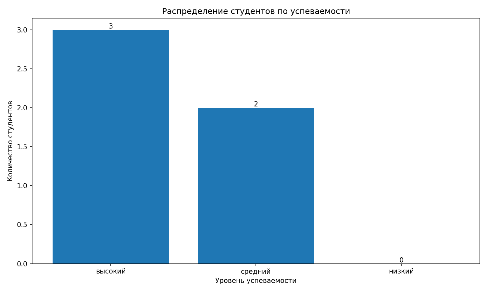
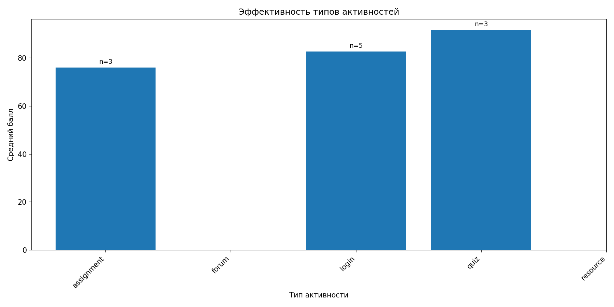
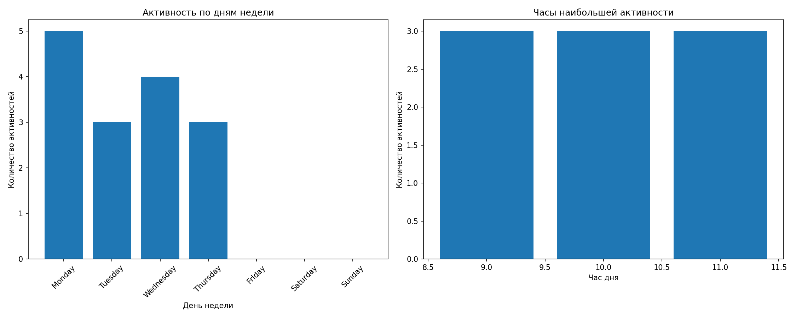

# Learning Path Analyzer

## Описание
**Learning Path Analyzer** — это система анализа пути обучения студентов на основе логов систем управления обучением (LMS). Проект анализирует различные типы активностей студентов (вход в систему, выполнение заданий, участие в форумах, прохождение тестов) и определяет, какие из них наиболее эффективны для успеваемости.

### Основные функции:
- 📊 Парсинг CSV файлов с логами LMS
- 🔍 Анализ корреляций между активностями и успеваемостью  
- 📈 Визуализация результатов (графики распределения оценок, эффективности активностей, временных паттернов)
- 💡 Генерация рекомендаций для оптимизации обучения
- 🔄 Автоматизированный CI/CD pipeline с ежедневной генерацией отчетов

## Установка

### Требования
- Python 3.8+
- pip

### Настройка
```bash
# Клонируйте репозиторий
git clone https://github.com/ваш-username/learning-path-analyzer.git
cd learning-path-analyzer

# Создайте виртуальное окружение
python -m venv venv

# Активируйте окружение
# На Windows:
venv\Scripts\activate
# На Mac/Linux:
source venv/bin/activate

# Установите зависимости
pip install -r requirements.txt
```

## Использование

### Базовый пример
```bash
# Запустите анализ на примере данных
python main.py --input data/sample_logs.csv --output results
```

После выполнения в папке `results` появятся:
- `results.json` — результаты анализа в JSON формате
- `score_distribution.png` — график распределения оценок
- `activity_effectiveness.png` — график эффективности активностей  
- `time_patterns.png` — график временных паттернов

### Расширенное использование
```bash
# Анализ конкретного студента (если есть данные)
python main.py --input data/sample_logs.csv --output results --student-id 1

# Использование своего CSV файла
python main.py --input ваш_файл.csv --output ваши_результаты

# Использование в Python коде
python -c "
from src.parser import LogParser
from src.analyzer import LearningAnalyzer
from src.visualizer import ResultVisualizer

# Парсинг данных
parser = LogParser('data/sample_logs.csv')
logs = parser.parse()

# Анализ
analyzer = LearningAnalyzer(logs)
results = analyzer.analyze_all()

# Визуализация
visualizer = ResultVisualizer(results)
visualizer.create_plots('results')

print(f'Проанализировано {len(logs)} записей')
"
```

## Структура проекта
```
learning-path-analyzer/
├── .github/workflows/      # CI/CD workflows
│   ├── ci.yml             # Основной pipeline: тесты + проверка кода
│   └── report.yml         # Креативный workflow: генерация отчетов по расписанию
├── data/                  # Данные для анализа
│   └── sample_logs.csv   # Пример CSV файла с логами LMS
├── src/                   # Исходный код
│   ├── __init__.py       # Инициализация модуля
│   ├── parser.py         # Парсинг CSV файлов
│   ├── analyzer.py       # Анализ данных и генерация рекомендаций
│   └── visualizer.py     # Создание графиков и визуализаций
├── tests/                # Юнит-тесты
│   ├── __init__.py
│   ├── test_parser.py    # Тесты парсера (2 теста)
│   └── test_analyzer.py  # Тесты анализатора (4 теста)
├── results/              # Автоматически создается при запуске
│   ├── results.json      # Результаты анализа в JSON
│   ├── *.png            # Графики визуализации
├── .gitignore           # Игнорируемые файлы (venv, результаты и т.д.)
├── requirements.txt     # Зависимости проекта
├── README.md           # Эта документация
└── main.py             # Точка входа в приложение
```

## Требования
Основные зависимости (полный список в `requirements.txt`):
- Pandas >= 2.0.0 — обработка табличных данных
- Matplotlib >= 3.7.0 — визуализация результатов
- NumPy >= 1.24.0 — математические операции
- Scikit-learn >= 1.3.0 — анализ данных и кластеризация
- Pytest >= 7.0.0 — тестирование кода
- Flake8 >= 6.0.0 — проверка стиля кода
- Black >= 23.0.0 — автоматическое форматирование

## Тестирование

Запуск тестов:
```bash
# Все тесты
pytest tests/

# С подробным выводом
pytest tests/ -v

# С покрытием кода
pytest --cov=src tests/
```

Проверка стиля кода:
```bash
# Проверка PEP 8
flake8 src/ --count --max-complexity=10

# Проверка форматирования
black --check src/ tests/

# Автоматическое форматирование
black src/ tests/
```

## CI/CD
Проект использует GitHub Actions для автоматизации:

### Основной workflow (`ci.yml`):
- Запускается при каждом push и pull request
- Выполняет тестирование
- Проверяет стиль кода (flake8, black)
- Уведомляет о статусе сборки

### Креативный workflow (`report.yml`):
- **Scheduled запуск**: ежедневно в 08:00 UTC
- **Workflow dispatch**: ручной запуск с параметрами (daily/weekly/monthly)
- Генерирует отчеты и сохраняет их как artifacts
- Создает визуализации и аналитику
- Пример креативного использования CI/CD для образовательных проектов

## Формат входных данных
CSV файл должен содержать следующие колонки:

```csv
student_id,activity_type,activity_name,timestamp,score,duration_minutes,course_id
1,login,Вход в систему,2024-01-15 09:30:00,,5,CS101
1,assignment,Домашняя работа 1,2024-01-15 10:00:00,85,45,CS101
2,forum,Обсуждение недели 1,2024-01-16 14:20:00,,20,CS101
```

**Обязательные колонки:**
- `student_id` — уникальный идентификатор студента
- `activity_type` — тип активности (login, assignment, forum, quiz, resource, video)
- `timestamp` — дата и время активности
- `score` — оценка (опционально)

## Примеры результатов
### 1. Распределение оценок студентов


### 2. Эффективность типов активностей  


### 3. Временные паттерны активности


## Вклад в проект
1. Форкните репозиторий
2. Создайте ветку для вашей фичи (`git checkout -b feature/amazing-feature`)
3. Закоммитьте изменения (`git commit -m 'Add amazing feature'`)
4. Запушьте в ветку (`git push origin feature/amazing-feature`)
5. Откройте Pull Request

## Автор
- Лапшин Антон, ИТ-23
-  GitHub: fem1x
-  GitVerse: anton.ls
---
